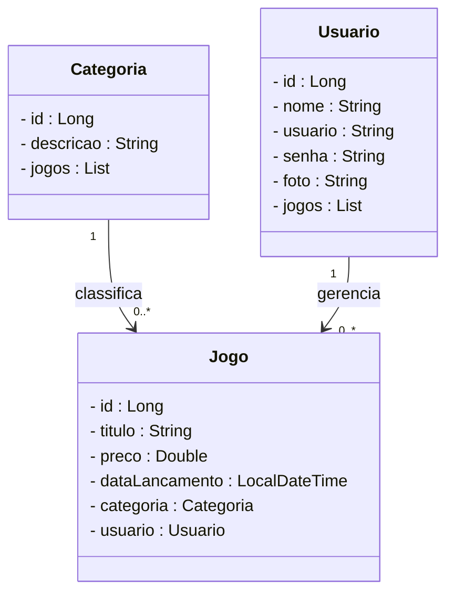
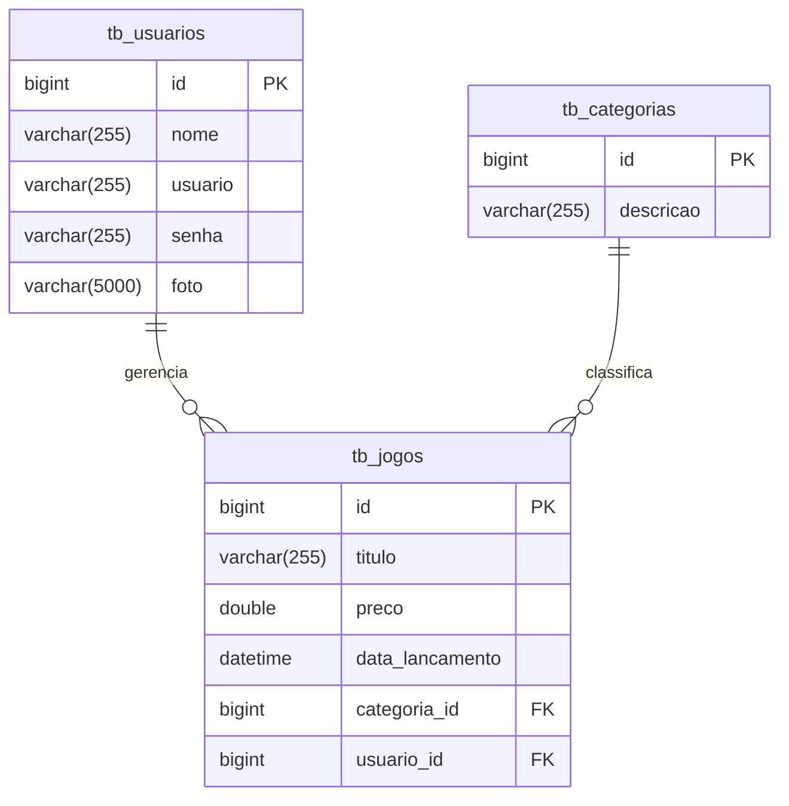

# Projeto Loja de Games - Backend com Spring Boot

<br />

<div align="center">

</div>

<br />

<div align="center">


</div>

<br />

## 1. Descrição

<br />

O **Loja de Games** é uma aplicação de e-commerce desenvolvida para gerenciar a venda de jogos digitais, permitindo que usuários consultem, comprem e gerenciem produtos (jogos) e categorias, com uma experiência segura e organizada. Este projeto foi criado com fins educacionais, simulando uma loja virtual real para praticar conceitos de API REST com **Java** e **Spring Boot**.

Entre os principais recursos da Loja de Games, destacam-se:

1. Cadastro, edição e exclusão de jogos
2. Organização de jogos por categorias (ex.: Ação, Aventura, RPG)
3. Cadastro e autenticação de usuários
4. Visualização de jogos por categoria ou pesquisa
5. Controle de acesso seguro para operações administrativas

<br />

## 2. Sobre esta API

<br />

A API da Loja de Games foi construída utilizando **Java** e o **framework Spring**, seguindo os princípios da arquitetura **MVC** e **REST**. Ela oferece endpoints para gerenciamento de recursos como **Usuário**, **Jogo** e **Categoria**, possibilitando interações dinâmicas entre clientes e a loja virtual.

<br />

### 2.1. Principais funcionalidades da API:

<br />

1. Cadastro, login, consulta e atualização de dados de usuários
2. Criação, consulta e gerenciamento de categorias para classificar jogos
3. Cadastro, edição, listagem e remoção de jogos
4. Associação de jogos a categorias e usuários (para compras ou administração)
5. Autenticação segura via token **JWT** para proteger requisições

<br />

### 2.2. Exemplo de Endpoints

<br />

Abaixo estão alguns exemplos de endpoints disponíveis na API, com requisições e respostas em JSON:

- **GET /jogos** - Lista todos os jogos
  **Requisição**:

  ```
  GET http://localhost:8080/jogos
  ```

  **Resposta (exemplo)**:

  ```json
  [
    {
      "id": 1,
      "titulo": "The Legend of Zelda",
      "preco": 59.99,
      "categoria": {
        "id": 1,
        "descricao": "Aventura"
      }
    },
    {
      "id": 2,
      "titulo": "Elden Ring",
      "preco": 69.99,
      "categoria": {
        "id": 2,
        "descricao": "RPG"
      }
    }
  ]
  ```

- **POST /usuarios/cadastrar** - Cadastra um novo usuário
  **Requisição**:

  ```json
  POST http://localhost:8080/usuarios/cadastrar
  {
    "nome": "João Gamer",
    "usuario": "joao.gamer@email.com",
    "senha": "123456",
    "foto": "https://example.com/foto.jpg"
  }
  ```

  **Resposta**:

  ```json
  {
    "id": 1,
    "nome": "João Gamer",
    "usuario": "joao.gamer@email.com",
    "foto": "https://example.com/foto.jpg"
  }
  ```

- **POST /jogos** - Cadastra um novo jogo (requer autenticação)
  **Requisição**:
  ```json
  POST http://localhost:8080/jogos
  Authorization: Bearer <jwt-token>
  {
    "titulo": "God of War",
    "preco": 49.99,
    "categoriaId": 1
  }
  ```
  **Resposta**:
  ```json
  {
    "id": 3,
    "titulo": "God of War",
    "preco": 49.99,
    "categoria": {
      "id": 1,
      "descricao": "Ação"
    }
  }
  ```

> [!TIP]
> Utilize ferramentas como [Insomnia](https://insomnia.rest/) ou [Postman](https://www.postman.com/) para testar os endpoints. A documentação completa está disponível em `http://localhost:8080/swagger-ui.html`.

<br />

## 3. Diagrama de Classes

<br />

O **Diagrama de Classes** representa a estrutura do sistema, exibindo as classes, seus atributos, métodos e relacionamentos, como associações e dependências. Este diagrama auxilia no planejamento e na compreensão da arquitetura do projeto.

<br />



> [!NOTE]
> Visualize o diagrama interativamente no [Mermaid Live Editor](https://mermaid.live/) copiando o código acima.

<br />

## 4. Diagrama Entidade-Relacionamento (DER)

<br />

O **DER** representa a organização dos dados no banco de dados relacional, mostrando as entidades e seus relacionamentos.

<br />



> [!NOTE]
> Visualize o diagrama interativamente no [Mermaid Live Editor](https://mermaid.live/) copiando o código acima.

<br />

## 5. Tecnologias Utilizadas

<br />

| Item                          | Descrição       |
| ----------------------------- | --------------- |
| **Servidor**                  | Tomcat          |
| **Linguagem de programação**  | Java            |
| **Framework**                 | Spring Boot     |
| **ORM**                       | JPA + Hibernate |
| **Banco de dados Relacional** | MySQL           |
| **Segurança**                 | Spring Security |
| **Autenticação**              | JWT             |
| **Testes automatizados**      | JUnit           |
| **Documentação**              | SpringDoc       |

<br />

## 6. Requisitos

<br />

Para executar o projeto localmente, você precisará:

- [Java JDK 17+](https://www.oracle.com/java/technologies/javase/jdk17-archive-downloads.html)
- Banco de dados [MySQL](https://dev.mysql.com/downloads/)
- [Spring Tool Suite (STS)](https://spring.io/tools)
- [Insomnia](https://insomnia.rest/download) ou [Postman](https://www.postman.com/)

<br />

## 7. Como Executar o Projeto no STS

<br />

### 7.1. Importando o Projeto

1. Clone o repositório do Projeto [Loja de Games](https://github.com/JuniorReis-dev/Loja_de_Games) dentro da pasta do _Workspace_ do STS:

```bash
git clone https://github.com/JuniorReis-dev/Loja_de_Games.git
```

2. **Abra o STS** e selecione a pasta do _Workspace_ onde você clonou o repositório do projeto.
3. No menu superior do STS, clique em: **File 🡲 Import...**
4. Na janela **Import**, selecione a opção: **General 🡲 Existing Projects into Workspace** e clique no botão **Next**.
5. Na janela **Import Projects**, no item **Select root directory**, clique no botão **Browse...** e selecione a pasta do Workspace onde você clonou o repositório do projeto.
6. O STS reconhecerá o projeto automaticamente.
7. Marque o Projeto Loja de Games no item **Projects** e clique no botão **Finish** para concluir a importação.

<br />

### 7.2. Executando o Projeto

1. Na guia **Boot Dashboard**, localize o **Projeto Loja de Games**.
2. Selecione o **Projeto Loja de Games**.
3. Clique no botão **Start or Restart**  para iniciar a aplicação.
4. Caso seja perguntado se você deseja autorizar o acesso ao projeto via rede, clique no botão **Permitir Acesso**.
5. Acompanhe a inicialização do projeto no console do STS.
6. Verifique se o banco de dados `db_loja_games` foi criado corretamente e se as tabelas foram geradas automaticamente.
7. Utilize o [Insomnia](https://insomnia.rest/) ou o [Postman](https://www.postman.com/) para testar os endpoints.

<br />

> [!TIP]
>
> Ao acessar a URL `http://localhost:8080` em seu navegador, a interface do **Swagger** será carregada automaticamente, permitindo a visualização e interação com os endpoints da API, além da consulta dos modelos de dados utilizados.

<br />

## 8. Contribuição

<br />

Este repositório é parte de um projeto educacional, mas contribuições são sempre bem-vindas! Caso tenha sugestões, correções ou melhorias, fique à vontade para:

- Criar uma **issue**
- Enviar um **pull request**
- Compartilhar com colegas que estejam aprendendo Java!

<br />

## 9. Contato

<br />

Desenvolvido por [**Junior Reis**](https://github.com/JuniorReis-dev)
Para dúvidas, sugestões ou colaborações, entre em contato via GitHub ou abra uma issue no repositório [Loja de Games](https://github.com/JuniorReis-dev/Loja_de_Games).
