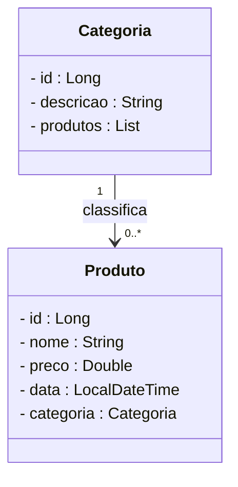
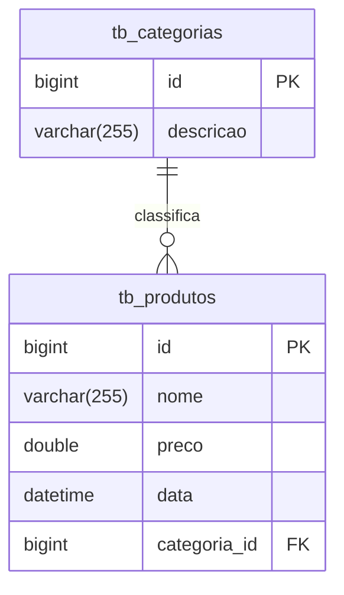

```markdown
# Loja de Games - Backend com Spring Boot

<div align="center">
<!-- Adicione a URL de um logo real aqui, hospedado no Imgur ou GitHub -->

</div>

<div align="center">


</div>

## 1. Descrição

O **Loja de Games** é uma aplicação de e-commerce desenvolvida para gerenciar a venda de jogos digitais, permitindo o cadastro, consulta e organização de produtos (jogos) por categorias. Este projeto foi criado com fins educacionais, simulando uma loja virtual para praticar conceitos de API REST com **Java** e **Spring Boot**.

**Recursos principais**:
- Cadastro, edição e exclusão de jogos
- Organização de jogos por categorias (ex.: Ação, Aventura, RPG)
- Consulta de jogos por categoria ou nome

## 2. Sobre esta API

A API da Loja de Games foi construída utilizando **Java** e o **framework Spring**, seguindo a arquitetura **MVC** e **REST**. Ela gerencia os recursos **Produto** e **Categoria**, com endpoints para operações de CRUD.

### 2.1. Endpoints da API

- **GET /produtos** - Lista todos os jogos
  **Exemplo de Resposta**:
  ```json
  [
    {
      "id": 1,
      "nome": "The Legend of Zelda",
      "preco": 59.99,
      "data": "2023-05-10T10:00:00",
      "categoria": { "id": 1, "descricao": "Aventura" }
    }
  ]
  ```

- **POST /produtos** - Cadastra um novo jogo
  **Exemplo de Requisição**:
  ```json
  {
    "nome": "God of War",
    "preco": 49.99,
    "data": "2022-11-09T00:00:00",
    "categoriaId": 1
  }
  ```

> [!TIP]
> Teste os endpoints com [Insomnia](https://insomnia.rest/) ou [Postman](https://www.postman.com/). Veja a documentação completa em `http://localhost:8080/swagger-ui.html`.

## 3. Estrutura do Projeto

O projeto segue a estrutura padrão de uma aplicação Spring Boot:
- **com.generation.lojadegames.model**: Contém as entidades `Produto` e `Categoria`.
- **com.generation.lojadegames.repository**: Repositórios JPA para acesso ao banco.
- **com.generation.lojadegames.controller**: Controladores REST para os endpoints.
- **application.properties**: Configurações do banco de dados MySQL (`db_loja_games`).

## 4. Diagrama de Classes



> [!NOTE]
> Visualize o diagrama no [Mermaid Live Editor](https://mermaid.live/).

## 5. Diagrama Entidade-Relacionamento (DER)



> [!NOTE]
> Visualize o diagrama no [Mermaid Live Editor](https://mermaid.live/).

## 6. Tecnologias Utilizadas

| Item                          | Descrição       |
|-------------------------------|-----------------|
| Servidor                     | Tomcat          |
| Linguagem de programação     | Java            |
| Framework                    | Spring Boot     |
| Gerenciador de Dependências  | Maven           |
| ORM                          | JPA + Hibernate |
| Banco de Dados               | MySQL           |

## 7. Requisitos

- [Java JDK 17+](https://www.oracle.com/java/technologies/javase/jdk17-archive-downloads.html)
- [MySQL](https://dev.mysql.com/downloads/)
- [Spring Tool Suite (STS)](https://spring.io/tools)
- [Insomnia](https://insomnia.rest/download) ou [Postman](https://www.postman.com/)

## 8. Como Executar

### 8.1. Importando o Projeto

1. Clone o repositório:
   ```bash
   git clone https://github.com/JuniorReis-dev/Loja_de_Games.git
   ```
2. Abra o STS e importe via **File > Import > Existing Projects into Workspace**.
3. Selecione a pasta do projeto e clique em **Finish**.

### 8.2. Executando

1. No STS, localize o projeto na **Boot Dashboard**.
2. Clique em **Start or Restart** .
3. Verifique se o banco `db_loja_games` foi criado.
4. Teste os endpoints com Insomnia ou Postman.

> [!TIP]
> Acesse `http://localhost:8080/swagger-ui.html` para a documentação da API, se configurada.

## 9. Contribuição

Contribuições são bem-vindas! Para colaborar:
- Crie uma **issue** para reportar bugs ou sugestões.
- Envie um **pull request** com melhorias.
- Compartilhe com outros aprendizes de Java!

## 10. Contato

Desenvolvido por [**Junior Reis**](https://github.com/JuniorReis-dev).
Para dúvidas ou colaborações, abra uma issue no [repositório](https://github.com/JuniorReis-dev/Loja_de_Games).
```